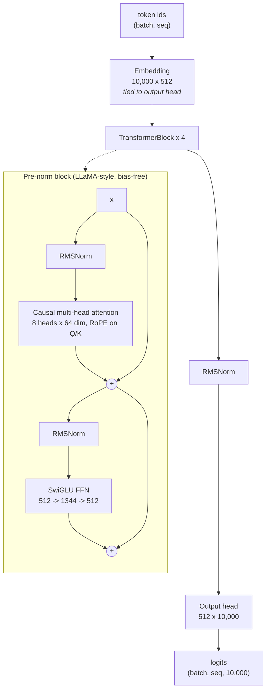
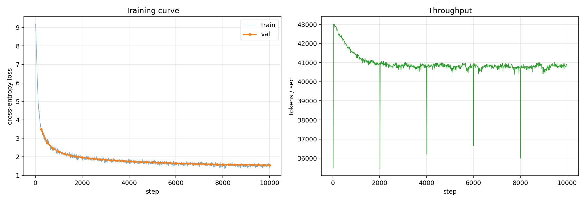

# transformer-from-scratch

A byte-level BPE tokenizer, a decoder-only Transformer, an AdamW optimizer, and LoRA
fine-tuning — all implemented from the underlying papers against raw PyTorch tensor
operations, then trained end-to-end on TinyStories and adapted to Shakespeare.

**Result:** a 17.6M-parameter model reaching **validation perplexity 4.72** after 35 minutes
on a single free-tier Kaggle T4, and a **261 KB LoRA adapter** (0.37% of parameters) that cuts
Shakespeare perplexity by **88%**.

> **Attribution.** The architecture and training curriculum are inspired by
> [Stanford CS336 Assignment 1](https://github.com/stanford-cs336/assignment1-basics)
> (Percy Liang and Tatsunori Hashimoto), with LoRA in the spirit of the course's later
> parameter-efficient fine-tuning material. **No course handout text, solution code, or
> starter code was used.** Every component here is written from the published papers cited
> below. This is independent work following a well-known curriculum, not a submission.

---

## What is actually built from scratch

The point of the project is that these are implemented, not imported. No `nn.Linear`,
`nn.Embedding`, `nn.LayerNorm`, `nn.MultiheadAttention`, `F.softmax`,
`F.scaled_dot_product_attention`, `F.cross_entropy`, or `torch.optim.AdamW` appears anywhere
in `src/`.

| Component | File | Reference |
|---|---|---|
| Byte-level BPE (train + encode/decode) | [`tokenizer/bpe.py`](src/tfs/tokenizer/bpe.py) | Sennrich et al. 2016; GPT-2 pretokenization |
| Linear, Embedding | [`nn/linear.py`](src/tfs/nn/linear.py), [`nn/embedding.py`](src/tfs/nn/embedding.py) | truncated-normal init |
| RMSNorm | [`nn/normalization.py`](src/tfs/nn/normalization.py) | Zhang & Sennrich 2019 |
| Rotary embeddings (RoPE) | [`nn/positional.py`](src/tfs/nn/positional.py) | Su et al. 2021 |
| SwiGLU feed-forward | [`nn/activations.py`](src/tfs/nn/activations.py) | Shazeer 2020 |
| Causal multi-head attention, softmax | [`nn/attention.py`](src/tfs/nn/attention.py) | Vaswani et al. 2017 |
| Cross-entropy (logsumexp-stable) | [`nn/loss.py`](src/tfs/nn/loss.py) | — |
| AdamW | [`optim/adamw.py`](src/tfs/optim/adamw.py) | Loshchilov & Hutter 2019 |
| Cosine schedule, gradient clipping | [`optim/schedule.py`](src/tfs/optim/schedule.py) | — |
| LoRA adapters | [`nn/lora.py`](src/tfs/nn/lora.py) | Hu et al. 2021 |

## Architecture



## Results

Single Kaggle T4, free tier. Full detail and raw logs in [`benchmarks/`](benchmarks/results.md).

| Metric | Value |
|---|---|
| Parameters | 17,576,448 |
| Validation perplexity | **4.72** |
| Training throughput | 40,838 tokens/s |
| Wall-clock (10,000 steps) | 35 min 12 s |
| BPE training (30 MB) | 30.8 s → 9,743 merges |
| Corpus encoding | 1,583,798 tokens/s |
| LoRA trainable parameters | 65,536 (0.37%) |
| LoRA adapter size | 261 KB |



### Sample output

Prompt `"Once upon a time"`:

> Once upon a time, there was a little girl named Lily. She had a big, soft teddy bear named
> Mr. Bear. Lily and Mr. Bear loved to play together all day long.
>
> One sunny day, Lily and Mr. Bear went to the park to play. They saw a pretty tree with lots
> of leaves. Lily said, "Mr. Bear, let's play hide and seek!" Mr. Bear nodded and they started
> to play.

## Two findings worth reading

### 1. Weight tying silently determines your initialization scale

The first full run started training at a loss of **342**, where a uniform predictor over a
10,000-token vocabulary scores ln(10,000) = **9.21**.

The embedding was initialized at std = 1.0. Under weight tying, that same matrix *is* the
output projection, so every logit is a 512-long dot product against it — putting logit std
near √512 ≈ 22.6 (measured: 22.59). The model spent its first several hundred steps doing
nothing but undoing its own initialization. Switching to GPT-2's std = 0.02, changing nothing
else:

| | std = 1.0 | std = 0.02 |
|---|---|---|
| Loss at step 10 | 342.50 | **9.19** |
| Val loss at step 250 | 8.95 | **3.48** |
| **Final val perplexity** | 6.07 | **4.72** |

**22% lower final perplexity from a one-line change.** RMSNorm renormalizes the input path
immediately, so the small init costs nothing going in. A regression test now asserts that a
fresh model predicts near-uniformly, tied or untied.

### 2. LoRA's cost is as measurable as its benefit

The adapter trains 0.37% of parameters and ships as a 261 KB file. On its target it is a
decisive win; on the domain it came from, it is a decisive loss:

| Domain | Base | + LoRA | Change |
|---|---|---|---|
| Shakespeare (target) | 824.85 | **96.06** | **−88.4%** |
| TinyStories (original) | 4.73 | 53.71 | **+1034.7%** |

Catastrophic forgetting is not a capacity problem at rank 8 — it is the adapter rotating
attention toward the new distribution. It is reported here rather than omitted, because the
one-sided version of this table is the more common and less useful one.

Qualitatively, the adapter transfers Shakespeare's *structure* — speaker labels, verse breaks,
dialogue framing — while vocabulary stays TinyStories, which is what adapting only
`q_proj`/`v_proj` should do: attention routing changes, frozen embeddings and FFNs keep the
lexicon. See [`benchmarks/results.md`](benchmarks/results.md) for samples.

## Quickstart

```bash
git clone https://github.com/VishnuValmiki3/transformer-from-scratch.git
cd transformer-from-scratch
python -m venv .venv && .venv/bin/pip install -e ".[dev]"   # Windows: .venv\Scripts\pip
pytest tests/ -q                                            # 138 tests, ~15 s on CPU
```

```bash
# 1. Download TinyStories, train BPE, encode to uint16 .bin
python -m tfs.data.prepare_tinystories --data-dir data/tinystories \
    --vocab-size 10000 --bpe-sample-chars 30000000 --max-train-chars 300000000 --workers 4

# 2. Pretrain (~35 min on a T4)
python -m tfs.train --config configs/tinystories_small.yaml

# 3. Sample
python -m tfs.generate --checkpoint checkpoints/tinystories/final.pt \
    --vocab data/tinystories/vocab.pkl --merges data/tinystories/merges.pkl \
    --prompt "Once upon a time"

# 4. LoRA fine-tune onto a new style, then sample with the adapter
python -m tfs.data.prepare_style_corpus --data-dir data/style \
    --vocab data/tinystories/vocab.pkl --merges data/tinystories/merges.pkl
python -m tfs.finetune_lora --config configs/lora_style_transfer.yaml
python -m tfs.generate --checkpoint checkpoints/tinystories/final.pt \
    --adapter checkpoints/lora_style/adapter.pt \
    --vocab data/tinystories/vocab.pkl --merges data/tinystories/merges.pkl \
    --prompt "Once upon a time"
```

No GPU? [`notebooks/kaggle_end_to_end.ipynb`](notebooks/kaggle_end_to_end.ipynb) runs the whole
pipeline on Kaggle's free T4 and reproduces every number above.

## Testing

138 tests, CPU-only, ~15 seconds. They assert mathematical properties rather than just shapes:

- **AdamW matches `torch.optim.AdamW` to 1e-6** over 25 steps across three hyperparameter
  settings — pinning bias correction and decoupled weight decay, not just "it runs"
- **RoPE** preserves vector norms, and Q·K depends only on *relative* position: `⟨R_i q, R_j k⟩`
  is invariant when both positions shift
- **RMSNorm** is scale-invariant and, unlike LayerNorm, leaves a nonzero mean nonzero
- **Causality** is verified by perturbation — editing a future token must not move earlier
  logits, at both the attention and whole-model level
- **Softmax** stays finite at logits of 1000; **cross-entropy** at 1e4
- **LoRA** with zero-initialized B reproduces the base model exactly; gradients reach only the
  adapters; merging adapters preserves outputs
- **Initialization** produces near-uniform predictions (the regression test from finding 1)

## Repository layout

```
src/tfs/
  tokenizer/bpe.py        BPE training + encoding, with a pretoken cache
  nn/                     Linear, Embedding, RMSNorm, RoPE, SwiGLU, attention, loss, LoRA
  optim/                  AdamW, cosine schedule, gradient clipping
  data/                   memmap sampling, TinyStories and style-corpus preparation
  train.py                config-driven loop: AMP, clipping, eval, JSONL metrics, resume
  finetune_lora.py        adapter injection, freezing, adapter-only checkpoints
  generate.py             temperature / top-p sampling, optional adapter
configs/                  training and LoRA hyperparameters
tests/                    138 tests
benchmarks/               metrics, curves, and the initialization ablation
notebooks/                end-to-end Kaggle run
```

## References

- Vaswani et al. (2017), *Attention Is All You Need*
- Sennrich et al. (2016), *Neural Machine Translation of Rare Words with Subword Units*
- Zhang & Sennrich (2019), *Root Mean Square Layer Normalization*
- Su et al. (2021), *RoFormer: Enhanced Transformer with Rotary Position Embedding*
- Shazeer (2020), *GLU Variants Improve Transformer*
- Loshchilov & Hutter (2019), *Decoupled Weight Decay Regularization*
- Hu et al. (2021), *LoRA: Low-Rank Adaptation of Large Language Models*
- Press & Wolf (2017), *Using the Output Embedding to Improve Language Models*
- Eldan & Li (2023), *TinyStories* — the training corpus

## License

MIT
